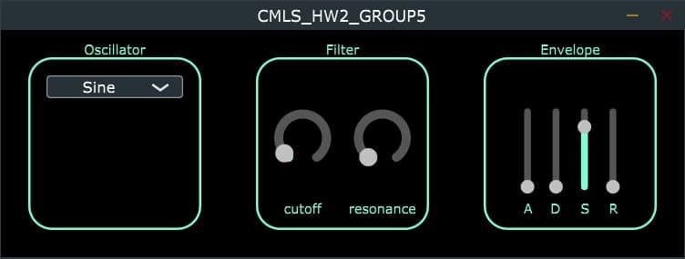

-------------------------------------------------------------------------------------------------------------------------------------------------------------------------------------------

## Project Demo

Here is a short video of demo - - > [Demo](https://youtu.be/-QUb9phxb1E)

-------------------------------------------------------------------------------------------------------------------------------------------------------------------------------------------

# Backend: synthesizer implementation in Juce

The plugin originally contained two main classes, the `PluginProcessor`, which handles audio and MIDI I/O and processing logic, and the `PluginEditor`, which handles GUI controls. With the reference to the Processor, the Editor can access and edit information and parameters from the audio thread, not the way around.

## The Synthesiser class

In order to develop a synthesizer in Juce, it is required to create a subclass of `SynthesiserSound` to describe each sound available to the synth, and a subclass of `SynthesiserVoice` which can play back one of these sounds. Since both classes are abstract ones, we had to implement all their pure virtual methods.

Once the `Synthesiser` object has been defined in Processor's header file, the memory for the voices is allocated at the very start of the `Processor`, in the heap, while the synth variables are initialized as always in `prepareToPlay` method. The actual sound is routed from the synth by calling the sinthesizer function `renderNextBlock` inside the `processBlock`, which provide the rendering of the synth' sound for each synthesiser's voice.

## Basic blocks of the synth

As mentioned above, synthesizer's basic elements have been implemented using Maximilian library and the dsp module of Juce. As for the synthesiser's classes, both oscillator, filter and envelope have been implemented in separate files for organization purposes. As a general
workflow, we have tried to optimize the code for the preparation and the update steps for all the elements of the plugin, with an intuitive organization of the code in blocks -i.e., filter, adsr and oscillator have their own update and prepare methods, which are called in the `processBlock`- method.
In order to decide what parameters the user is capable of modify through the UI, we used `valueTreeState` to link the UI elements and the actual parameters we want the user to play with.

# MIDI handling

In order for the plugin to work properly with MIDI messages, `SynthesiserVoice` class require as pure virtual methods `startNote` and `stopNote`, which are called whenever a MIDI note is pressed or released respectively. The first method triggers the envelope and tunes the correspondent voice's frequency, while the latter method stops the envelope and resets the state of the voice which stopped playing.

# ADSR envelope

As previously mentioned, the envelope we decided to implement in our plugin is the ADSR envelope contained in Maximilian library.[@JUCE_tutorials] As well as for the other basic components, the envelope object have been defined in the `SynthVoice` class. In order
for the user to interact with it, we developed a very intuitive 4-sliders-composed GUI, with attached below the textbox indicating the parameter of the envelope controlled by each slider. After initializing the parameters within the ValueTree declaration in the `Processor`, we implemented the two main functions -regarding envelope parameters-, which are `setEnvelopeParameters` and `setEnvelope`, in `SynthVoice` class, following the reasoning that everything which modify the sound (i.e, a voice) goes in SynthVoice, while everything regarding graphical elements and the attachment between UI and parameters is in the \"reserved\" header and implementation files. Indeed, both slider declarations and styling as well as the ValueTree attachment are computed in `Envelope.cpp` and `Envelope.h`, respectively. Regarding the graphical implementation, we reasoned in terms of blocks, with the slider one the right-end side of the User Interface.
The ADSR parameters were set up as follows:

-   Attack: from 0.1 up to 5000 ms, default value = 0.1 ms;

-   Decay: from 1.0 up to 2000 ms, default value = 0.1 ms;

-   Sustain: from 0 up to 1, default value = 0.8;

-   Release: from 0.1 up to 5000 ms, default value = 0.1 ms;

In terms of computational flow, the processBlock checks for each voice -as always- the current values of the sliders through the method `getRawParameterValue`, then the voice's envelope parameters are updated. Finally, the audio output is routed through `renderNextBlock` method of the synthesiser. As a stylistical choice, we decided to apply the envelope only when a new key is pressed, and the call`env1.trigger=1` is  onsequently made in `SynthVoice.startNote` method.

# Oscillator class

To implement the oscillator in our synthetizer, we decided to create a class(composed of a cpp and a header file), where the behaviour of the oscillator is defined. To implement it, we used the dsp Juce modules, and oscillator functions are the standard and useful functions of any
oscillator in a synthetizer. The oscillator has two main functions, **setOscillatorWaveform**) that is basically a switch method used to select the type of waveform our oscillator is going to play, and is made of three choices: - sine wave, obtained using the default method std::sin - sawtooth, that is obtained using the MathConstant library - square wave, obtained as a scaling function between -1 and 1. The second main method is the **setOscillatorFrequency**) method, used to select the frequency played by the oscillator. Like in every VST or synth, the frequency played is never decided first, but is given by keyboard(MIDI) input, as it is in this case. The method, in fact, gets a MIDI message in input and translate it to get the actual frequency in Hz of the MIDI note played by the user. After preparing the audio context with the **prepareToPlay**) method, the oscillator is called in the `SynthVoice` class.

## GUI Oscillator

For the UI of the Oscillator, we used the ComboBox class, that we basically needed for the waveform selection, and sliders, that will be used also in the `Filter` component. To interact with the oscillator, the user can see basically the waveform label(Sine, Square, Saw); We also used a *ValueTreeState* variable for the WaveSelector, that links the parameters set by the interacting user with the ComboBox class. The same variable is used also on filters, and basically does the same thing, connecting the \"graphical\" value given by the user to the actual controller value of the filter. Other methods in Oscillator interface are used to show and display filters, fundamental in oscillators' audio processing, with the possibility given to the user of making them rotating, for example. To make filters visible to the user in the GUI, we used the *addAndMakeVisible* method.

{width=".9\\linewidth"}

# The Filter section and its UI implementation

Once the previous parts of the plugin has been created, we implemented the Filter section of the VST. As we did when implementing the other sections (such as the oscillator) we created a new class called Filter (composed by both a cpp and a header file) where we defined the \"behaviour\" of the filter and the UI components that will be visible by the user when interacting with the VST plugin. The filter created is specifically a lowpass filter that has two main parameters: a Cutoff and a Resonance. Due to this fact, we decided to define a UI composed by just two distinct sliders (one for each parameter) that will allow the user to change the cutoff frequency or the resonance of the filter and two labels (one for each slider) in order to visually associate the slider with the correspondent parameter of the filter. All these parameters will be included inside the \"classical rounded rectangle\" we used to represent the each different section of the plugin. 

## UI of the Filter

As mentioned before, we defined two private slider variables (called **filterCutoff** and **filterRes**) inside Filter.h, each one of them referring to a specific parameter of the filter. Moreover, for each variable we added a *ValueTreeState* variable (called, respectively, **filterVal** and **resVal**) that will represent the link for connecting the graphical values obtained by the graphical sliders (when interacting with the user) with the data that will be processed in order to practically apply the filter with that values to the oscillator's sound. Inside the Filter.cpp file, we edited every graphical part of the filter's section.In particular, inside the constructor we initialized the variables previously defined as private inside the filter.h file. Then, by using the command *addAndMakeVisible*, we added the two sliders in order to be visible to the user in the UI filter section. Inside the paint method of the file, we drawn every component adding also the labels we mentioned  efore by using the drawText() command. Due to the fact that in Juce is possible to  ersonalize the way the processor draws each component (choosing the color and the style of sliders, for example) avoiding the use of  he default \"design settings\", we decided to personalize the graphics adding the  getLookAndFeel().setColour* methods (the *getLookAndFeel* implements exactly this kind of personalization in Juce). Finally, inside the resized method, we set the bounds of:

1.  the rectangle in which every component will be drawn (reducing it with the *reduced()* method in order to not have any problem of  conflicting elements with the boundaries)

2.  the **filterCutoff** and **filterRes** bounds.

To conclude and make the graphical Filter object available on the plugin, we updated the PluginEditor files ( both cpp and header). In the PluginEditor.h file we just included the filter class through the \#include command and then we declared in the private section a Filter variable (called filterGUI) in order to have the possibility to add a single Filter component to the overall plugin. Inside the PluginEditor.cpp file we inserted a few lines of code:

1.  inside the constructor method, we added an addAndMakeVisible(&filterGUI) in order to make the Filter component visible.

2.  Inside the resized method we set the bounds of the filterGUI object, defining its position with respect to the other components and sections (oscillator and ADSR components). As we did for every other component, we set up the bounds using two different components called componentWidth and componentHeight, just to properly design the position of the section inside the plugin and in a symmetric fashion.

3.  We linked the filter's constructor to the AudioProcessorEditor.

## Data Processing of the Filter

Once the graphical part has been realized, we created the \"backend components\" of the filters that will be able to process the data and to modify it in several ways. To do so, we defined a filter object (we called it filter1) and two float variables called cutoff and resonance (which represent the main parameters we implemented during the UI filter definition). Since the filter modifies the perception of the sound, we placed the variables inside the SynthVoice.h file, where the main elements working with the sound are placed. Moreover, we also needed two methods: one that can be used to extract the current resonance and cutoff values, and a second one which can set the value to the filter. So, we created the method getFilParam() and the method setFilter(). Both this methods have been defined and implemented inside the SynthVoice header file.The first one simply updates the current values of the cutoff and resonance of the filter, substituting the values with the ones coming from the slider variables. The second one sets the filter. We defined a private variable inside the PluginProcessor.h called lowPassFilter, as an IIR filter coming from the dsp module of Juce. Once these passages have been implemented, we created probably the most important method ( regarding the filter section) that extracts the current values of the filter (coming from the graphical sliders) and updates the state of the filter. This method has been called updateFilter and it has been placed inside the PluginProcessor.cpp. The extraction is realized through the following lines of code:` int freq = *tree.getRawParameterValue("filterCutoff"); int res = *tree.getRawParameterValue("filterRes");` The update of the filter is realised through the following line of code: `*lowPassFilter.state=*juce::dsp::IIR:: Coefficients<float>::makeLowPass(lastSampleRate,freq,res);`. Another important part is related to the connection between the GUI filter parts and the backend variables we used to do the calculations. To do so,we used the ValueTreeState tree variable adding two more connections: the first one with the filterCutoff slider, the second with the filterRes slider. With this connection, the values of the sliders are now accessible and we just need to modify the processBlock section of the PluginProcessor.cpp file. Inside it , we extracted the new filter's value with the main for cycle (saving them into two variables called newFilterCutoff and newFilterRes),we invoked the getFilParam() that updated the current values of the filter, we called updateFilter() and then processed the filter with the new reference values. The last missing part was about the prepareToPlay method: before starting we called the reset method of the filter (`lowPassFilter.reset();`) and then the prepare method.

# Conclusion

We have implemented a subtractive synthesizer by doing this assignment. It was built as a VST3 file. We can load and test it by using **AudioPluginHost.exe**. With this VST3 file you can customize the sound waveform, the values of the ADSR, cutOff, resonance parameters to get the sound you want, and save it (the state of each parameters value). But our method and parameter settings are too dependent on the methods given in the reference. So we can continue working on adjusting the parameters and methods to make our synthesizer(VST3) much more better.